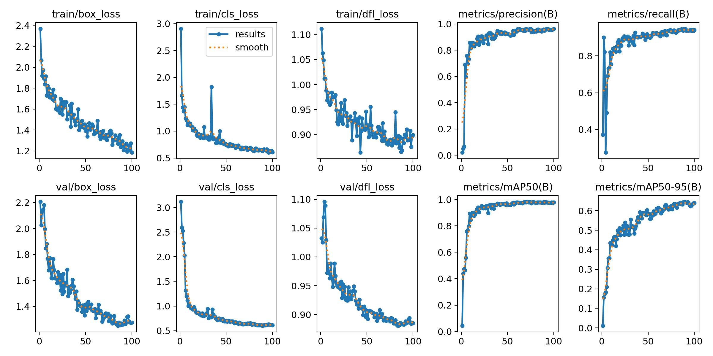
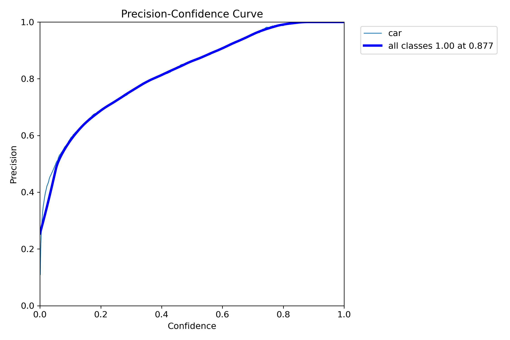
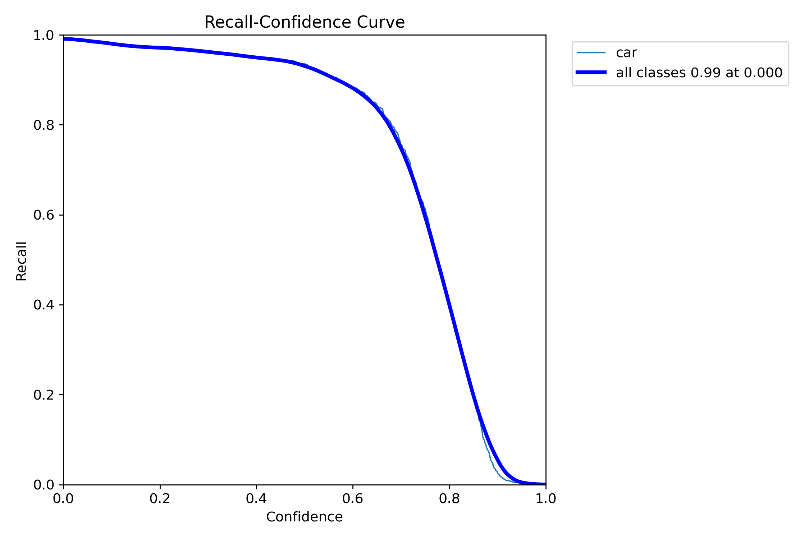
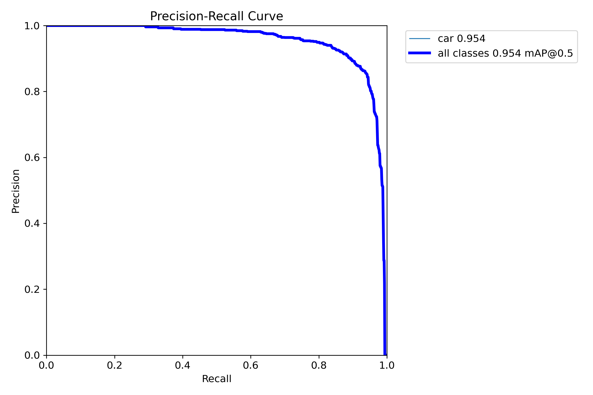
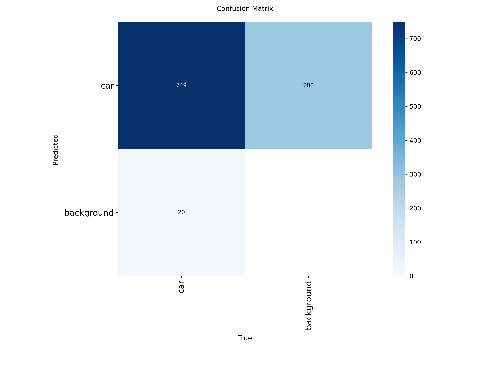
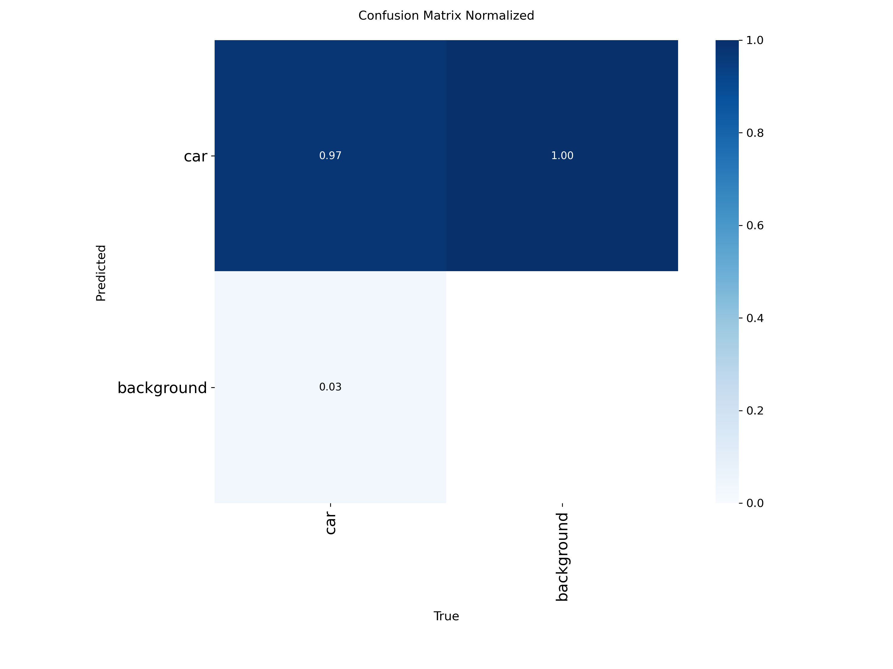
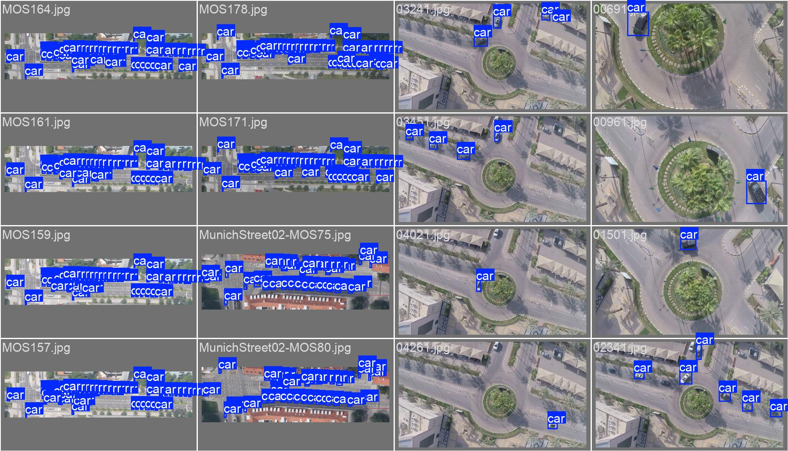
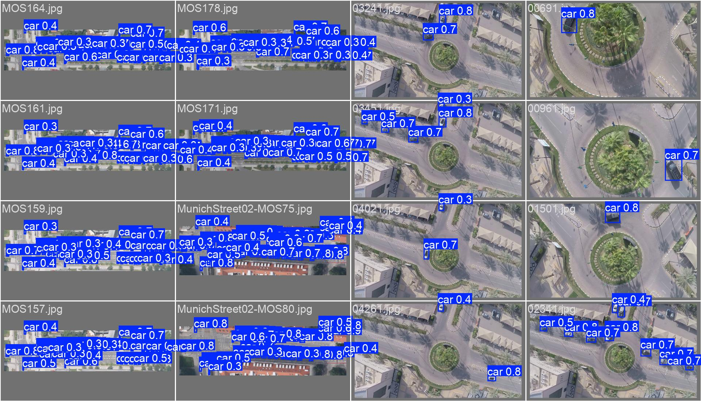

# Project Report

## 1. Summary
This project trains an object detector for urban street scenes with a primary focus on detecting cars. The training pipeline is configuration-driven and uses the Ultralytics YOLO framework; experiment artifacts are stored under `runs/detect/`.

## 2. Data Overview
- **Location**: `data/` (images) and `data/labels/` (YOLO `.txt` labels). Original Pascal VOC `.xml` annotations are in `data-original/`.
- **Split**: Train / Val / Test directories are used as specified in `data/data.yaml`.
- **Classes**: 1 class defined (`car`) as per `data/data.yaml`.

## 3. Preprocessing and Augmentation
- **Image size**: Training images were resized to 640 px (`imgsz=640`).
- **Augmentation**: Augmentation was enabled during training (mosaic, horizontal/vertical flips, HSV jittering, random scale/translate, etc.). See run args for exact parameters.
- **Label format**: YOLO-format `.txt` files (class x_center y_center width height) are used; original XMLs were converted accordingly.

## 4. Model Selection
The experiments used the Ultralytics YOLOv8 family (base model: `yolov8n`). This model provides a compact and fast architecture suitable for edge or resource-constrained deployments while maintaining strong detection accuracy.

## 5. Training Configuration (actual run)
The report below reflects the values recorded for the experiment saved at `runs/detect/experiment_20260415_114501` (see `args.yaml` in that folder):

- **Model**: `yolov8n` (Ultralytics)
- **Epochs**: 100
- **Batch size**: 8
- **Optimizer**: `auto` (Ultralytics default selection)
- **Initial LR**: 0.001
- **Momentum**: 0.937
- **Weight decay**: 0.0005
- **Patience (early stop)**: 20
- **Image size**: 640
- **Mixed precision (AMP)**: enabled
- **Device**: GPU (`device: '0'` in the run args)

The training was performed via `pipeline/2-train.py` using values from `config.yaml`, with a specific run captured in `runs/detect/experiment_20260415_114501/args.yaml`.

## 6. Evaluation Metrics & Results
Final reported metrics for epoch 100 (see `runs/detect/experiment_20260415_114501/results.csv`):

- **Precision (B)**: 96.44%
- **Recall (B)**: 94.02%
- **mAP@0.5 (B)**: 97.74%
- **mAP@0.5:0.95 (B)**: 63.97%

These values come from the per-epoch metrics in `runs/detect/experiment_20260415_114501/results.csv`. For full per-epoch details and plots, see the same folder (e.g., `results.png`, `BoxP_curve.png`, `BoxR_curve.png`).

## 7. Failure Cases and Limitations
- **Observed failure modes**: occasional false positives on small/occluded cars and reduced performance on unusual viewpoints or extreme lighting.
- **Dependency issues**: When deploying the model on a Linux cloud environment, the `python-opencv` library caused conflicts. It was resolved by using `python-opencv-headless` instead.
- **Video input performance**: Video input during deployment exhibited freezing and lagging issues, which were not observed during local testing.
- **Limitations**: limited dataset diversity (single class, limited environmental variation) and modest dataset size—these constrain generalization to novel scenes.

## 8. Recommendations
- Collect more diverse samples (different weather, times of day, occlusions).
- Increase annotation coverage for edge cases and rare viewpoints.
- Consider larger YOLOv8 variants or ensembling for higher mAP@0.5:0.95 if deployment budget allows.

## 9. Deployed Model

You can try the deployed model online using the following link:

https://sager-model.streamlit.app

---

## Visual Artifacts

### Training summary

### Curves

### Diagnostics

### Example validation batches

